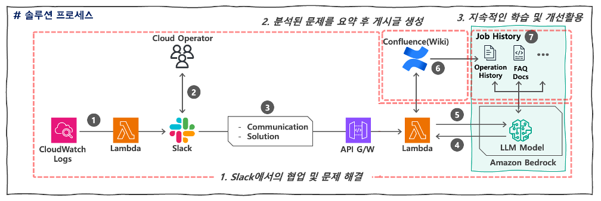
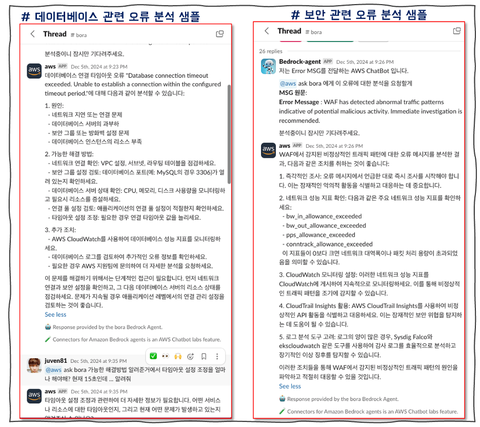
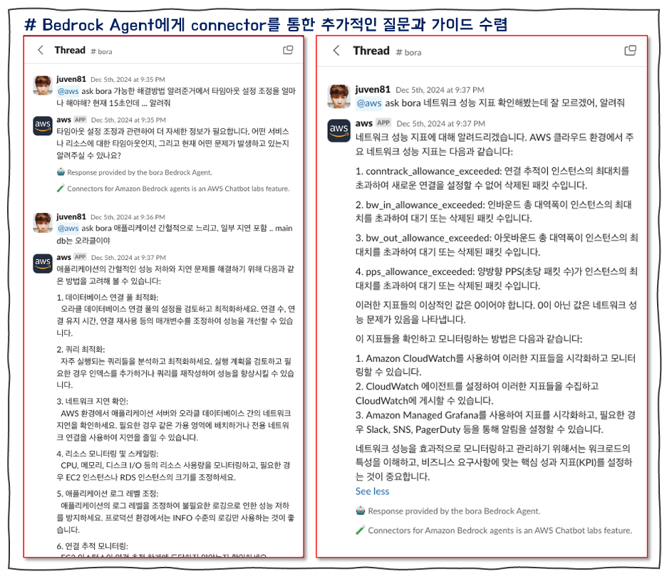
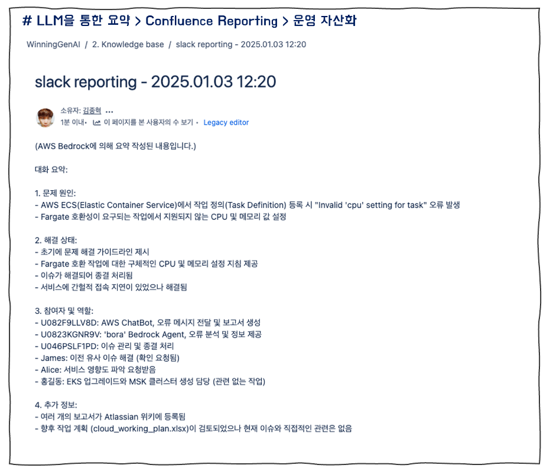
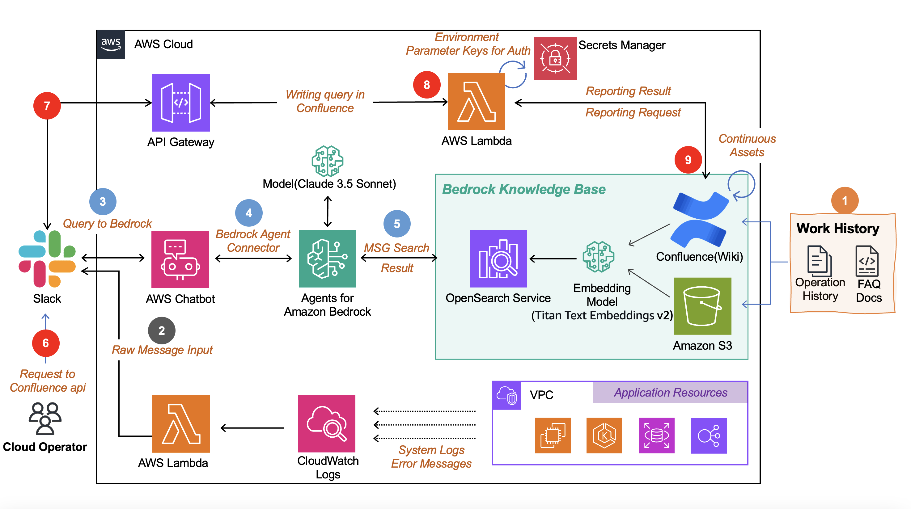

# 🤖AWS GenAI를 활용한 IT 서비스 운영 자동화

현대의 IT 인프라 환경은 그 규모와 복잡성이 기하급수적으로 증가하고 있습니다. 클라우드 네이티브 아키텍처의 도입이나 마이크로서비스 기반 애플리케이션의 확산으로 기업의 IT 운영팀이 대응해야 할 영역은 지속적으로 확장되고 있습니다. 특히 시스템 전반에서 발생하는 다양한 종류의 로그 데이터, 메트릭 그리고 메시지들을 효과적으로 분석하고 신속하게 대응하는 것이 중요한 과제로 떠오르고 있습니다. 
1. 신속한 장애 대응의 필요성
특히 운영중인 시스템에 장애가 발생할 경우, IT운영팀은 해당 원인을 신속히 파악하고 해결해야 하는데, 시스템 규모 그리고 아키텍처 복잡성으로 인해 증가된 정보는 에러 메시지 발생시 빠르게 근본 원인을 식별하기가 어렵습니다. 게다가 다양한 연관 솔루션을 운영한다면 IT운영팀의 부담은 더욱 가중됩니다.
2. 지식의 자산화 필요성
또한 장애가 해결된 이후에도 동일한 문제 발생 시 과거의 경험을 바탕으로 보다 빠르고 효율적으로 해결할 수 있다면 IT운영팀의 축적된 장애 대응 경험과 해결 노하우가 매우 중요한 자산입니다. 그래서 우리는 이러한 정보를 잘 요약된 내용으로 정리하여 추후 장애 시 활용한다면 장애의 빈도가 높은 모듈에 대한 개선 그리고 업무의 효율성을 높일 수 있습니다.

본 페이지는 AWS GenAI를 활용한 IT 서비스 운영 자동화를 직접 구현해 보기 위해 Workshop형태로 제작 되었습니다. 
전체적인 내용은 2025년 2월 11일 게시된
<a href="https://aws.amazon.com/ko/blogs/tech/generative-ai-incident-response-knowledge-base/" target="_blank">AWS Tech Blog</a> 를 통해 확인해 보실 수 있습니다.

---

## 📋 목차
1. [Workshop 소개](#Workshop-소개)
2. [Workshop의 결과물](#Workshop의-결과물)
3. [전체 아키텍처 및 흐름](#전체-아키텍처-및-흐름)
4. [AWS 서비스 구성](#AWS-서비스-구성)
6. [환경설정](#환경설정)

---

## Workshop 소개

이 Workshop에서는 위와 같은 문제를 지원하기 위해 AWS의 생성형 AI서비스와 기업에서 주로 활용중인 협업 도구인 Slack, Atlassian Confluence를 통합한 생성형 AI 기반 클라우드 운영 지원 솔루션을 소개할 예정입니다. 솔루션은 아래 그림과 같이 총 3개의 주요한 흐름으로 구성되어 있습니다.
1. Slack에서의 협업 및 문제 해결(①,②,③,④,⑤)
2. 분석 된 문제를 요약 후 게시글 생성(⑥)
3. 지속적인 학습 및 개선활용(⑦)

  

---

## Workshop의 결과물 

이 Workshop을 완료하면 다음과 같이 IT서비스 운영에 활용되는 Usecase를 경험해 볼 수 있습니다.

Usecase 1 : 운영중 수신되는 Error Message에 대한 빠른 분석 
  

Usecase 2 : Knowledge Bases 를 통한 문제의 근본 원인 분석 및 해결 방안 제시 
  

Usecase 3 : 분석이 완료된 내용을 Wiki에 등록하고 팀의 자산화 
  

## 전체 아키텍처 및 흐름

아래는 이 Workshop을 통해 구현될 전체 아키텍처입니다:

   
  
 
이 솔루션의 전체 아키텍처는 위와 같으며 이 Workshop에서는 아래의 Step별로 구현해 보겠습니다.   

* [환경설정](SETUP.md) - AWS Account Setup(Workshop용 Account일 경우 참조)
* [Preparations](cloudformation/README.md) - Workshop에 필요한 Resources(AWS Lambda Code, Amazon API GW 등)를 미리 배포
* [Step1](detail/step1.md) - IT운영팀의 업무자산을 Amazon Bedrock Knowledge Bases로 구성 
* [Step2](detail/step2.md) - Amazon Bedrock Agent를 생성하고 Amazon Bedrock Knowledge Bases와 연동 
* [Step3](detail/step3.md) - Log 모니터링 및 알림 메시지 수신을 위한 Slack 구성 및 AWS와 연동 
  (실제 IT운영에서는 다양한 경로로 수집될 것이나 Workshop에서는 AWS Lambda로 임의 Error Log를 발생시킵니다.) 
* [Step4](detail/step4.md) - AWS Lambda 와 Amazon API Gateway로 Slack과 Confluence 연동 
* [Step5](detail/step5.md) - 시나리오 기반으로 테스트 하기

---

## AWS 서비스 구성

📌 이 Workshop에서 활용되는 서비스는 다음과 같습니다:
- [Amazon Bedrock](https://aws.amazon.com/ko/bedrock/?gclid=Cj0KCQiAu8W6BhC-ARIsACEQoDBE17GRP0CN9_RYey5dt_x4D8ZOkbwhjaOYxXRQJBIjXvMEX_-iaqsaAsBpEALw_wcB&trk=24a8f13a-f5db-4127-bcb7-8b2876aa4265&sc_channel=ps&ef_id=Cj0KCQiAu8W6BhC-ARIsACEQoDBE17GRP0CN9_RYey5dt_x4D8ZOkbwhjaOYxXRQJBIjXvMEX_-iaqsaAsBpEALw_wcB:G:s&s_kwcid=AL!4422!3!692062155749!e!!g!!amazon%20bedrock!21058131112!157173586057): Amazon Bedrock은 AWS의 생성형 AI 서비스로, Claude, AI21 Labs의 Jurassic-2, AWS Titan과 같은 대규모 언어 모델(LLM)을 제공합니다. 이를 통해 로그 분석, 문제 원인 파악, 해결 방안 제안, 자동 요약 생성 등 다양한 AI 작업을 수행할 수 있습니다.
- [Agents for Amazon Bedrock](https://aws.amazon.com/ko/bedrock/agents/): 워크플로를 간소화하고 반복적인 작업을 자동화며 사용자 요청을 처리하고, 필요한 정보를 수집하며, 효율적으로 응답을 생성하는 역할을 합니다.
- [Amazon Bedrock Knowledge Bases](https://aws.amazon.com/ko/bedrock/knowledge-bases/): Amazon Bedrock의 파운데이션 모델(FM)을 회사 데이터에 안전하게 연결하여 검색 증강 생성(RAG)을 지원할 수 있습니다. 추가 데이터에 액세스하면 지속적으로 FM을 재훈련할 필요 없이 관련성이 높고 상황에 맞는 정확한 응답을 생성하는 데 도움이 됩니다. 운영팀의 경험과 과거 문제 해결 사례를 체계적으로 저장하여 LLM에게 학습 자료를 제공합니다. 이를 통해 응답은 지속적으로 개선되고 더 나은 결과를 도출할 수 있습니다. [RAG(Retrieval Augmented Generation)](https://aws.amazon.com/ko/what-is/retrieval-augmented-generation/) 기술을 활용하여 데이터를 검색하고, 기초 모델의 프롬프트를 보강하여 보다 정확하고 관련성 높은 응답을 생성하도록 돕습니다.
- [AWS Lambda](https://aws.amazon.com/ko/pm/lambda/?trk=b28d8305-f5fb-4858-9ae6-04a78cfcc154&sc_channel=ps&ef_id=Cj0KCQiAu8W6BhC-ARIsACEQoDCaiN5jSrKlp6eHXuDuXjyspRqC7cZaJSndstvxrVZD0bmw6DTQ7fEaArTdEALw_wcB:G:s&s_kwcid=AL!4422!3!651510601848!e!!g!!aws%20lambda!19836398350!150095232634) :이벤트에 대한 응답으로 코드를 실행하고 컴퓨팅 리소스를 자동으로 관리하는 컴퓨팅 서비스이며, 이 솔루션에서는 서버리스 컴퓨팅 환경에서 각종 로그 데이터 수신 및 Slack 내 Event 수행과 대화중인 Thread에 대해 Prompt를 통해 Atlassian Confluence 로의 Reporting 을 수행하게 됩니다. 이 과정을 수행하며 Atlassian Confluence는 지속적인 장애 히스토리를 업데이트 하며 향후 자산으로 활용할 수 있게 됩니다.
- [AWS Chatbot](https://aws.amazon.com/ko/chatbot/): AWS Chatbot은 Microsoft Teams, Slack과 같은 협업 도구와 AWS 리소스를 연결합니다. 특히, 2024년 9월 17일에 출시된 Slack과 Agents for Amazon Bedrock 간 상호작용 기능은 운영팀이 Slack 내에서 직접 LLM과의 대화를 통해 장애 대응과 해결을 수행할 수 있도록 지원합니다.
- [AWS Secrets Manager](https://docs.aws.amazon.com/ko_kr/secretsmanager/latest/userguide/intro.html) : 데이터베이스나 애플리케이션의 보안 인증, OAuth 토큰, API 키 및 기타 암호를 관리, 검색, 교체할 수 있습니다. 이 블로그에서는 AWS Lambda가 수행할 Task에 필요한 협업도구의 인증 정보들를 Secrets 으로 저장하고 AWS Lambda의 환경변수로 활용했습니다.
- [Slack](https://slack.com/intl/ko-kr/) :운영팀이 익숙하게 사용하는 협업 도구로 Message 전달용 Bot과 연동하고AWS Chatbot과 통합하여 실시간 문제 해결을 Agents connector 로 수행합니다.
- [Atlassian Confluence](https://www.atlassian.com/software/confluence) : 팀이 프로젝트나 아이디어를 통해 작업을 체계적으로 조직하고 공유하여 모든 팀원이 협업할 수 있는 도구이며, 팀의 지속적인 Knowledge Bases으로 활용 됩니다.

## 환경설정

📌 이 Workshop을 수행하려면 다음이 준비되어야 합니다:
- AWS Account: 강사가 제공하는 AWS Workshop Account를 통해서 모든 실습을 진행합니다. 
- Slack 계정: Slack은 개인별로 생성합니다. 
  . 사내/개인용 Slack APP과 연동되지 않도록 Web브라우저를 통해서 실습 권장 
  . Slack에 가입 이력이 없는 New Email 계정 활용을 권장(ex> 기존Gmail+1@gmail.com) 
- Atlassian Confluence: Atlassian Confluence는 강사가 제공하는 정보를 활용합니다. 
  . URL 정보 
  . Account Email 정보 
  . API Key 정보
- 인터넷 브라우저: 이 워크샵에서는 최신 버전의 Chrome 또는 Firefox를 사용을 권장 드립니다.

---

자\~ 이제 실습 준비를 위해 [환경설정](SETUP.md)으로 이동해 볼까요?
<!--
## 설치 및 설정: > [재영님 폴더 이동 링크](cloudformation/README.md)

### 1️⃣ 코드 클론
git clone h........
cd aws-........

### 2️⃣ AWS 리소스 배포
AWS CloudFormation 템플릿을 사용하여 리소스를 배포합니다.
재영님 폴더 이동 메뉴 링크

### 3️⃣ Slack 설정
1. AWS Management Console에서 **AWS Chatbot** 서비스 열기.
2. Slack 채널 추가.
3. 필요한 권한 부여 및 채널 URL 설정.

### 4️⃣ 환경 변수 구성
`.env` 파일에 필요한 환경 변수를 추가합니다:
SLACK_WEBHOOK_URL=https://hooks.slack.com/services/...
AWS_REGION=us-east-1
-->
---

